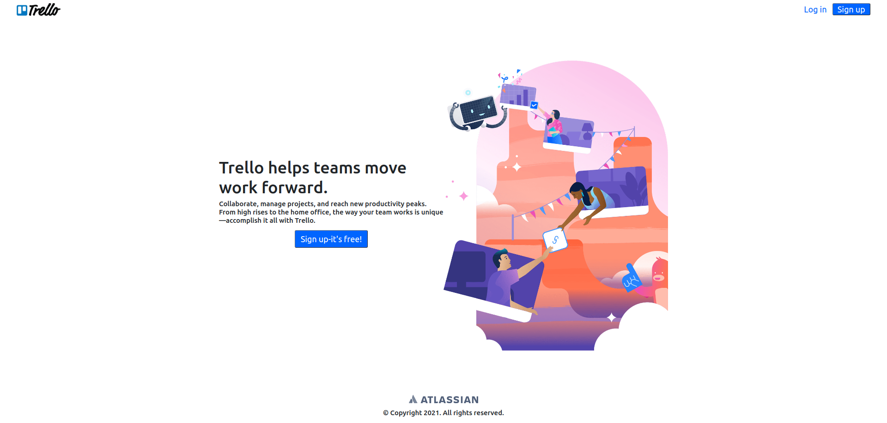
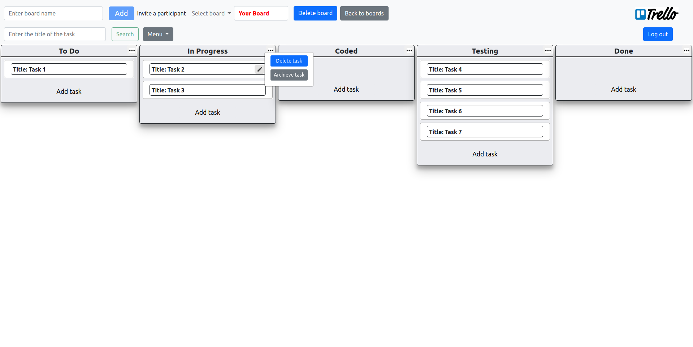

#  Trello-clone application(client side)




# This Trello-clone app is an example of a kanban-board.
The app allows:
- Сreate boards
- Delete boards
- Rename boards
- Add tasks to board
- Delete tasks or task
- Rename tasks(title or text)
- Move tasks on the board
- Archive and restore tasks
- View archived tasks
- Search for tasks on the board
- View the history of actions on board tasks
- Invite other app users to the board
- Assign task executor to users who have been invited to the board
- Remove the task from the executor
- The invited user has the right only to view tasks and the ability to exit the task if he is the executor

## Application Technology Stack

The application is written by HTML/CSS/TypeScript/Angular

# To launch the app, you need to:

 Open terminal and follow the next commands:
 
 - Clone the repository
 
  ```sh
  $ git clone https://github.com/Superior-925/Trello-frontend.git
  ```

- Go to project folder

```sh
 $ cd Trello-frontend
  ```

- Install dependencies by NPM
 
 ```
 $ npm install
```

- Launch the applications
 
 ```sh
$ npm start
```

- Go to the following link http://localhost:4200

If you have questions - contact me on email skykeeper925@gmail.com.
Best regards Antony Logunov.
